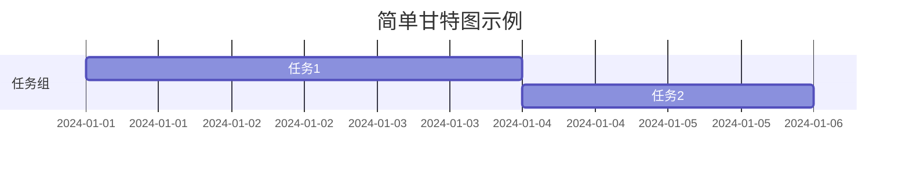
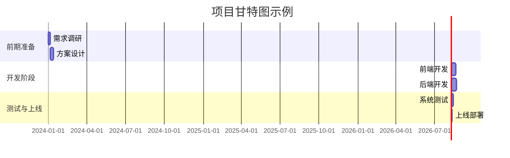

# 📈Markdown绘制甘特图技巧详细教程

想象一下，你要规划一场大型的派对，从筹备食材、布置场地到安排节目，各项任务繁多且有时间顺序。甘特图就像是这场派对的时间规划表，能清晰展示每个任务的开始和结束时间，让一切有条不紊。在这篇教程里，我们将从头开始，学会用Markdown绘制甘特图。

## 了解甘特图
### 甘特图是什么
甘特图是一种以图表形式展示项目进度的工具，它用条形图来表示项目中各个任务的时间安排。就好比我们前面说的派对规划，每个任务（比如采购食材、布置场地）就像条形图中的一段，从开始时间画到结束时间，这样一眼就能看出任务的时长和先后顺序。

### 为什么用Markdown绘制甘特图
Markdown是一种轻量级的标记语言，简单易写，很多平台都支持。用Markdown绘制甘特图，不需要复杂的绘图软件，只要按照特定的语法规则编写代码，就能快速生成甘特图，方便又高效。

## 准备工作
### 选择支持Markdown甘特图的平台
不是所有支持Markdown的地方都能绘制甘特图，我们需要找一个支持的平台，比如Typora、GitLab、GitHub等。这里以Typora为例，它是一款简洁易用的Markdown编辑器，对甘特图有很好的支持。

### 安装Typora
你可以从Typora的官方网站（https://typora.io/）下载适合你操作系统的安装包，然后按照安装向导的提示完成安装。

## 开始绘制甘特图
### 基本语法结构
在Typora中，绘制甘特图需要使用代码块，代码块以```mermaid开头，以```结尾，中间就是甘特图的具体代码。下面是一个简单的示例：

代码解释：
- ```mermaid```：表示这是一个Mermaid代码块，Mermaid是一种用于生成图表的工具，Markdown借助它来绘制甘特图。
- ```dateFormat YYYY-MM-DD```：指定日期的格式为年-月-日。
- ```title 简单甘特图示例```：设置甘特图的标题。
- ```section 任务组```：将任务分组，这里创建了一个名为“任务组”的任务组。
- ```任务1           :a1, 2024-01-01, 3d```：定义一个名为“任务1”的任务，```a1```是该任务的标识符，用于后续任务的依赖关系；```2024-01-01```是任务的开始日期；```3d```表示任务持续3天。
- ```任务2           :after a1, 2d```：定义一个名为“任务2”的任务，```after a1```表示该任务在“任务1”结束后开始，```2d```表示任务持续2天。

### 常见错误及解决办法
- **甘特图不显示**：可能是代码语法有误，仔细检查代码中的日期格式、任务标识符等是否正确。也有可能是平台不支持，尝试换一个支持的平台。
- **日期格式错误**：要确保```dateFormat```指定的格式和代码中使用的日期格式一致，比如指定了```YYYY-MM-DD```，就不能写成```MM/DD/YYYY```。

### 更复杂的甘特图示例

代码解释：
- 这里创建了三个任务组：“前期准备”、“开发阶段”、“测试与上线”。
- 每个任务都有自己的标识符（如```a1```、```a2```等），方便后续任务指定依赖关系。
- 不同任务组的任务可以有不同的开始时间和持续时间，通过```after```关键字来表示任务之间的先后顺序。

## 小结
### 核心内容总结
- 甘特图是展示项目任务时间安排的工具，用条形图表示任务的时长和顺序。
- 可以用Markdown绘制甘特图，借助Mermaid工具，在支持的平台上实现。
- 绘制甘特图的基本语法包括代码块开头的```mermaid```、日期格式设置、任务组和任务的定义。

### 补充资源链接
- Mermaid官方文档（https://mermaid-js.github.io/mermaid/#/）：可以查看更多关于Mermaid图表的详细语法和示例。
- Typora官方教程（https://support.typora.io/）：了解Typora的更多使用技巧。

## 下一步建议
- 尝试在不同的平台（如GitLab、GitHub）上绘制甘特图，熟悉不同平台的使用方法。
- 学习Mermaid的更多高级语法，如设置任务的进度、添加里程碑等，让甘特图更加丰富和实用。可以参考进阶教程：[Mermaid甘特图高级用法](https://example.com/advanced-mermaid-gantt) 。

通过以上步骤，相信你已经掌握了用Markdown绘制甘特图的基本技巧，快去试试为自己的项目规划一个清晰的甘特图吧！ 